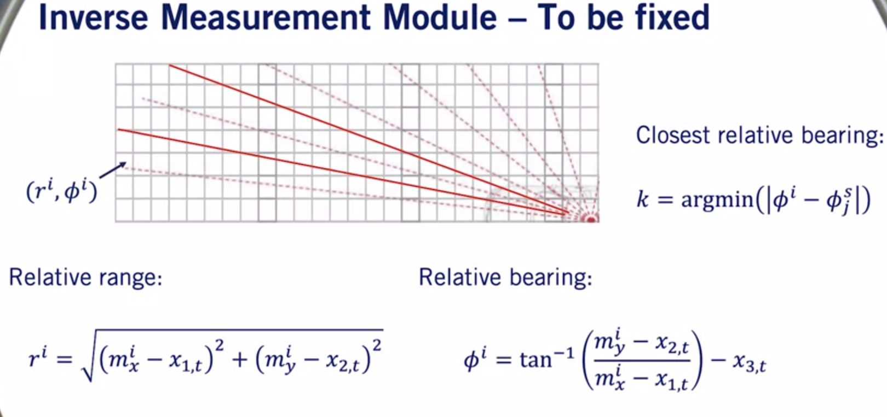
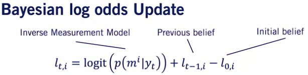

# Occupany Grid Generation Using LIDAR Scanner Measurements

This repository contains a notebook with occupancy grid generation assignment that was part of Coursera's [Motion Planning for Self-Driving Cars](https://www.coursera.org/learn/motion-planning-self-driving-cars/home/welcome) course.

In this assignment, an occupancy grid is generated using lidar scanner measurements from a moving vehicle in an unknown environment. Inverse scanner measurement model is developed to map these measurements into occupancy probabilities, and then perform iterative logodds updates to an occupancy grid belief map. After the car has gathered enough data, the occupancy grid generated as a result should converge to the true map.

## Generating inverse scanner measurement model
First, the vehicle gathers measurement data of the environment which is transformed from cartesian coordinate system to polar coordinate system.

Given the range measurements and the robot location, the scanned values in polar coordinate system are then passed to the inverse scanner to generate occupancy grid probabilities.
![inverse_scanner_model]

## Calculate and update logodds of the occupancy grid
At each time interval, the measured occupancy probabilities from the inverse model are used to update the belief map. Bayes' rule is applied to update the occupancy grid as follows:

## Using LogOdds
The probability of occupancy in a certain grid can be any value between 0 and 1. The probabilities of occupancy are updated at each time instant when the new set of measurement data is available from the LIDAR scanner. This may result in probability values very close to zero and multiplication of such numbers is hard for computers. Hence, while computing, instead of dealing with probabilities, logodds ratio can be stored and used and ultimately, after all the computation, logodds ratio can be converted back to probability in order to generate the belief map.

## Result
Following visualization is created to visualize the robot's motion in the true map, measured belief map, and the occupancy grid belief map below. These are shown in the 1st, 2nd, and 3rd videos, respectively.

The occupancy grid belief map matches the true map very closely at the end of the simulation.

#### 1. True map of the environment

#### 2. Inverse scanner model result at each time interval throughout the simulation

#### 3. Occupancy grid belief map

